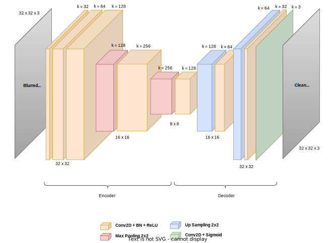
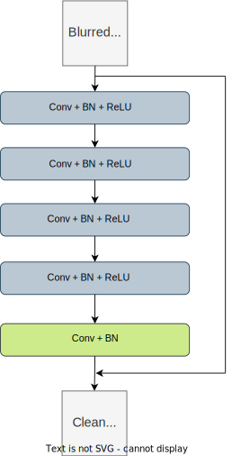

# CIFAR-10-Image-Deblurring

The aim of this project is to solve an image deblurring task on a set of CIFAR-10 images, manually corrupted with both gaussian noise and gaussian blur.
In order to deal with the problem, in the `CIFAR_10_Image_Deblurring.ipynb` notebook two different approaches have been described and analyzed, namely a Convolutional Autoencoder and the Win5-RB network, finally comparing their results. In particular, performances of the two models have been evaluated through the computation of the mean squared error (MSE) between the test set of original images (ground truth) and those restored by the networks, starting from the corrupted ones. 

## Convolutional Autoencoder

The first approach adopted is a convolutional autoencoder.

An autoencoder is a network trained to reconstruct input data out of a learned internal representation. In particular, the architecture is composed by an encoder and a decoder: the input data is compressed into latent variables by the encoder and then restored by the decoder, starting from the previously compressed latent variables.

A convolutional autoencoder is a traditional autoencoder where convolutional layers are used in both the encoder and the decoder parts. In deblurring images tasks, the encoder can learn to extract meaningful features from the input blurred image, producing a down-sampled latent image representation. Then, starting from the latent image and performing up-sampling, the decoder can learn to produce a non-noisy reconstruction of the input image.

In this project, the structure of the CAE network is as follows:

  

## Win5-RB

The second approach adopted relies on Win5-RB architecture.

Win5-RB（Wide Inference Network 5layer + Resnet and BatchNormalization）is a model composed by 5 convolutional layers, each of them followed by a ReLU (except for the last layer) and a Batch Normalization. A skip connection from input-end to output-end is also added to implement residual learning.

The peculiar attribute of this kind of architecture is the exploitation of the "width" of the network, namely the number of filters and the size of the kernels for each layer, in order to extract more accurate pixel-distribution features through larger receptive fields, even with a shallow structure.

In this project, the structure of the Win5-RB network is as follows:

  

